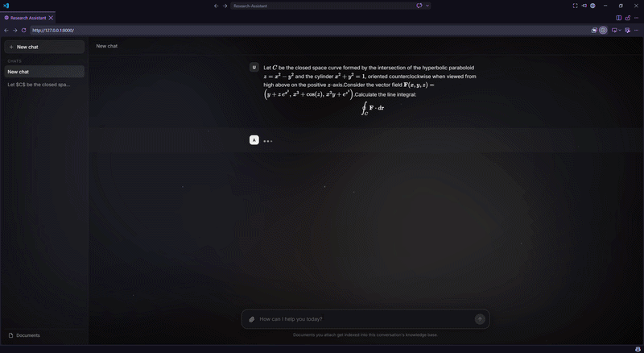

# Research-Assistant

A local-first AI research assistant with a clean web UI for chatting with LLMs, uploading documents, and searching your knowledge base with hybrid RAG. Your chats are stored on your own machine, and you can switch models by editing `agent/llms.py`.

## Demo



## What it does

Research-Assistant gives you a simple GUI where you can:

* chat with any supported LLM provider
* upload documents into a local knowledge base
* list, delete, and manage documents
* create new chats and delete old ones
* stream responses from the backend to the frontend
* keep chat history stored locally on your machine

Hybrid search is enabled by default, and the project also includes methods for dense-only and sparse-only retrieval.

## Why I built it

This project was built to learn and practice:

* RAG systems
* AI agents
* FastAPI backend development
* LangChain and LangGraph orchestration
* local document search and retrieval
* frontend/backend communication for AI applications

## Features

* Local chat UI
* Document upload and management
* Streaming responses
* Chat history stored locally with SQLite and SQLAlchemy
* Hybrid RAG retrieval with Qdrant
* Easy model swapping in `agent/llms.py`
* Dense-only and sparse-only retrieval options
* Document listing and deletion
* Chat creation and deletion
* Live web search via Tavily for up-to-date information
* FastAPI backend
* Frontend built with HTML, CSS, and JavaScript

## Tech Stack

* FastAPI
* SQLAlchemy
* SQLite
* LangChain
* LangGraph
* Gemini
* Qdrant
* Tavily
* HTML
* CSS
* JavaScript

## How it works

1. You open the website.
2. You send a message through the frontend.
3. The frontend sends the request to the FastAPI backend.
4. The backend routes the request, retrieves context if needed, and streams the answer back.
5. Documents are embedded and stored in Qdrant for hybrid search.
6. Chats and metadata are stored locally on your machine.

## Project structure

```bash
research-assistant/
├── agent/
│   ├── agent_schemas.py
│   ├── graph.py
│   ├── llms.py
│   ├── nodes.py
│   ├── prompts.py
│   ├── web_service.py
│   └── __init__.py
├── app/
│   ├── backend/
│   │   ├── main.py
│   │   ├── lifespan.py
│   │   ├── __init__.py
│   │   ├── database/
│   │   │   ├── base.py
│   │   │   ├── database.py
│   │   │   ├── models.py
│   │   │   └── repositories.py
│   │   ├── routers/
│   │   │   ├── chat_router.py
│   │   │   └── document_router.py
│   │   ├── schemas/
│   │   │   ├── chat.py
│   │   │   ├── conversation.py
│   │   │   └── document.py
│   │   └── services/
│   │       ├── chat_service.py
│   │       └── document_service.py
│   ├── frontend/
│   │   └── index.html
│   └── __init__.py
├── rag/
│   ├── builders.py
│   ├── chunker.py
│   ├── embedder.py
│   ├── loader.py
│   ├── qdrant_manager.py
│   ├── rag_schemas.py
│   ├── rag_service.py
│   ├── reranker.py
│   ├── retriever.py
│   └── __init__.py
├── .env.example
├── requirements.txt
└── README.md
```

## Getting started

### 1. Clone the repository

```bash
git clone https://github.com/AbdelrhmanEbied/research-assistant.git
cd research-assistant
```

### 2. Create a virtual environment

```bash
python -m venv .venv
source .venv/bin/activate
```

On Windows:

```bash
.venv\Scripts\activate
```

### 3. Install dependencies

```bash
# If you are using pip
pip install -r requirements.txt

# Or if you are using uv
uv sync
```

### 4. Configure your environment

Copy `.env.example` to `.env` and fill in your keys:

```bash
cp .env.example .env
```

On Windows:

```bash
copy .env.example .env
```

```env
GEMINI_API_KEY=your_gemini_api_key_here
TAVILY_API_KEY=your_tavily_api_key_here
```

### 5. Run the app

```bash
uvicorn app.backend.main:app --host 127.0.0.1 --port 8000 --reload
```

> If you use [uv](https://github.com/astral-sh/uv) as your package manager, you can run it instead with:
> ```bash
> uv run uvicorn app.backend.main:app --host 127.0.0.1 --port 8000 --reload
> ```

Then open `http://127.0.0.1:8000` in your browser.

## Changing the model

To switch models, edit `agent/llms.py` and change the model name there. The app is designed so that any supported LLM provider can be used as long as it is configured in that file.

## Credits

* Frontend by [geopero123](https://github.com/geopero123)
* Backend, agent, and RAG pipeline by [AbdelrhmanEbied](https://github.com/AbdelrhmanEbied)

## License

This project is licensed under the Apache License 2.0.